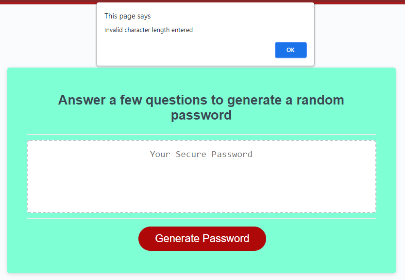
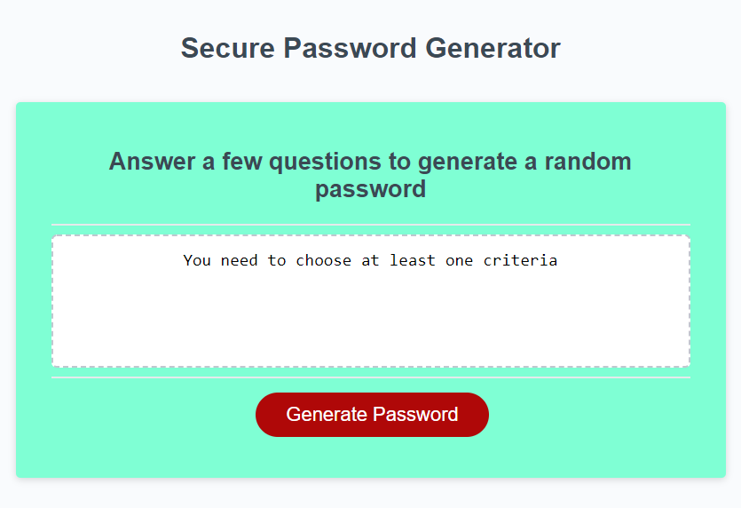

# Password Generator

In this task we were given some code and our task was to create a random password generator.
The user is given prompts and based on their answer the machine would spit out the password accordingly.

I started off creating my variables, then i wrote out all the possible outcomes based off the questions asked.

The next step was to generate the password based off one question first and then once i was able to do that incoporate the other questions.

I needed to ensure that no errors were passing through when generating the password in console and i think i achieved that even if the user did not select the required criteria.

Below is a screen shot of the error when a user selects either less than 8 or greater than 128 chacters.

Below is a screen shot of the error if the user does not choose any criteria for their passcode.

The URL for the password generator is: https://trangthedev.github.io/Password_Generator-/

